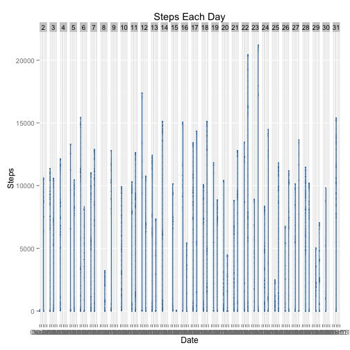
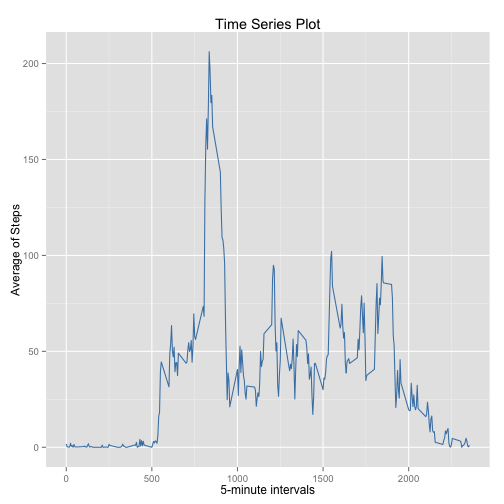
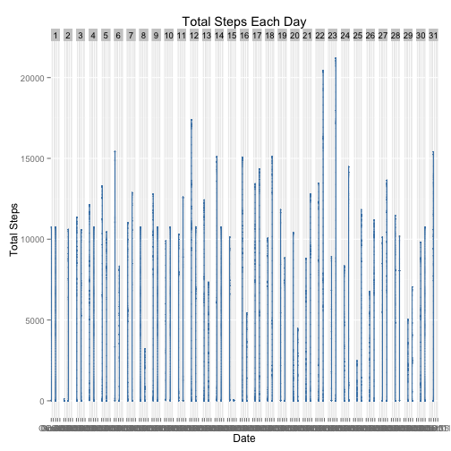

## Coursera - *Data Science* 

### Loading and preprocessing the data

```r
data <- read.csv("~/Desktop/activity.csv")
data$date <- as.Date(data$date)
data$interval <- as.numeric(data$interval)
data$day <- as.numeric(format(data$date, "%d"))
data.nona <- na.omit(data)
```

### What is mean total number of steps taken per day?
Calculate and report the mean and median of the total number of steps taken per day

```r
library(ggplot2)
ggplot(data.nona, aes(date, steps)) + geom_histogram(stat="identity",color="steelblue",fill = "steelblue", width = 1) + facet_grid(. ~ day) + labs(title = "Steps Each Day", x = "Date", y = "Steps")
```

 

```r
steps.perday <- aggregate(data.nona$steps, list(Date = data.nona$date), FUN = "sum")
mean(steps.perday$x)
```

```
## [1] 10766.19
```

```r
median(steps.perday$x)
```

```
## [1] 10765
```

### What is the average daily activity pattern?
Make a time series plot of the 5-minute interval (x-axis) and the average number of steps taken, averaged across all days (y-axis)
Which 5-minute interval, on average across all the days in the dataset, contains the maximum number of steps?

```r
steps.avg <- aggregate(data.nona$steps, list(interval = data.nona$interval), FUN = "mean")
names(steps.avg)[2] <- "stepsmean"

ggplot(steps.avg, aes(interval, stepsmean)) + geom_line(color = "steelblue") + labs(title = "Time Series Plot", x = "5-minute intervals", y = "Average of Steps")
```

 

```r
steps.avg[steps.avg$stepsmean == max(steps.avg$stepsmean), ]
```

```
##     interval stepsmean
## 104      835  206.1698
```

### Imputing missing values
Calculate and report the total number of missing values in the dataset
Devise a strategy for filling in all of the missing values in the dataset. (I use the mean of 5-minute interval)
Create a new dataset that is equal to the original dataset but with the missing data filled in

```r
sum(is.na(data))
```

```
## [1] 2304
```

```r
data.new <- data 
for (i in 1:nrow(data.new)) {
    if (is.na(data.new$steps[i])) {
        data.new$steps[i] <- steps.avg[which(data.new$interval[i] == steps.avg$interval), ]$stepsmean
    }
}

sum(is.na(data.new))
```

```
## [1] 0
```
Make a histogram of the total number of steps taken each day and Calculate and report the mean and median total number of steps taken per day

```r
ggplot(data.new, aes(date, steps)) + geom_histogram(stat = "identity", colour = "steelblue", fill = "steelblue", width = 0.7) + facet_grid(. ~ day) + labs(title = "Total Steps Each Day", x = "Date", y = "Total Steps")
```

 
Do these values differ from the estimates from the first part of the assignment? 
What is the impact of imputing missing data on the estimates of the total daily number of steps?

```r
steps.perday.new <- aggregate(data.new$steps, 
                           list(Date = data.new$date), 
                           FUN = "sum")
mean(steps.perday.new$x)
```

```
## [1] 10766.19
```

```r
median(steps.perday.new$x)
```

```
## [1] 10766.19
```

```r
mean(steps.perday$x) - mean(steps.perday.new$x)
```

```
## [1] 0
```

```r
median(steps.perday$x) - median(steps.perday.new$x)
```

```
## [1] -1.188679
```

### Are there differences in activity patterns between weekdays and weekends?
Create a new factor variable in the dataset with two levels – “weekday” and “weekend” indicating whether a given date is a weekday or weekend day.

```r
data.new$weekdays <- factor(format(data.new$date, "%A"))
levels(data.new$weekdays) <- list(weekday = c("Monday", "Tuesday", "Wednesday", "Thursday", "Friday"), weekend = c("Saturday", "Sunday"))
```
Make a panel plot containing a time series plot (i.e. type = "l") of the 5-minute interval (x-axis) and the average number of steps taken, averaged across all weekday days or weekend days (y-axis). 

```r
steps.avg <- aggregate(data.new$steps, list(interval = data.new$interval, weekdays = data.new$weekdays),FUN = "mean")
names(steps.avg)[3] <- "stepsmean"

library(lattice)
xyplot(steps.avg$stepsmean ~ steps.avg$interval | steps.avg$weekdays, 
       layout = c(1, 2), type = "l", 
       xlab = "Interval", ylab = "Number of steps")
```

 
